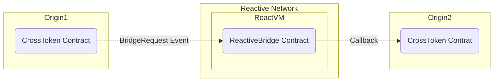

# Reactive Bridge Demo

## Overview

This demo illustrates a basic use case of the Reactive Network, showcasing a token bridge between two chains. The setup consists of a ERC20 token contract deployed on origin & destination chains, with a Reactive Contract managing the bridge between them. The Reactive Contract listens for events on both chains, emits logs, and triggers callbacks based on predefined conditions.



## Contracts

The demo involves two contracts:

1. **Origin & Destination Chain Contract:** `CrossToken.sol` is a Simple ERC20 token contract that can be deployed on both the origin and destination chains(called as origin1, origin2). It emits an event `BridgeRequest` when a user requests a bridge transfer from one chain to another. The event contains the user's address and the amount to be bridged.

2. **Reactive Contract:** `ReactiveBridge.sol` subscribes to events on both origin & destination, emits logs, and triggers callbacks when conditions are met, such as when `BridgeRequest` is emitted on the either of the chains, The callback is sent to the other chain with payload data to mint tokens on the destination chain. This contract is designed to support two-way token bridging(A->B and B->A). Right now, the demo only supports A->B because, Sepolia is only destination chain supported by Reactive Network.

## Deployment & Testing

To deploy testnet contracts to Sepolia, follow these steps, making sure you substitute the appropriate keys, addresses, and endpoints where necessary. You will need the following environment variables configured appropriately to follow this script:

- `ORIGIN1_RPC`
- `ORIGIN2_RPC`
- `REACTIVE_RPC`
- `PRIVATE_KEY`
- `ORIGIN1_ADDR`
- `ORIGIN2_ADDR`
- `ORIGIN1_CHAINID`
- `ORIGIN2_CHAINID`
- `SYSTEM_CONTRACT_ADDR`
- `CALLBACK_SENDER_ADDR`

You can use the recommended Sepolia RPC URL: `https://rpc2.sepolia.org`.

Load the environment variables:

```bash
source .env
```

### Step 1

Deploy the `CrossToken` with authorized callback sender on both chains(eg. Polygon & Sepolia) and assign the `Deployed to` address from the response to `ORIGIN1_ADDR` and `ORIGIN2_ADDR` respectively.

```bash
forge create --rpc-url $ORIGIN1_RPC --private-key $PRIVATE_KEY src/demos/token-bridge/CrossToken.sol:CrossToken --constructor-args 1000000000000000000000 $CALLBACK_SENDER_ADDR

forge create --rpc-url $ORIGIN2_RPC --private-key $PRIVATE_KEY src/demos/token-bridge/CrossToken.sol:CrossToken --constructor-args 1000000000000000000000 $CALLBACK_SENDER_ADDR
```

#### Callback Payment

To ensure a successful callback, the callback contract(both origin1, origin2 contracts) must have an ETH balance. You can find more details [here](https://dev.reactive.network/system-contract#callback-payments). To fund the callback contracts, run the following command:

```bash
cast send $ORIGIN1_ADDR --rpc-url $ORIGIN1_RPC --private-key $PRIVATE_KEY --value 0.1ether

cast send $ORIGIN2_ADDR --rpc-url $ORIGIN2_RPC --private-key $PRIVATE_KEY --value 0.1ether
```

### Step 3

Deploy the `ReactiveBridge.sol` (reactive contract), configuring it to listen to `BridgeRequest` event on both chains(origin1, origin2) and trigger a callback to the other chain with the payload data.

```bash
forge create --rpc-url $REACTIVE_RPC --private-key $PRIVATE_KEY src/demos/token-bridge/ReactiveBridge.sol:ReactiveBridge --constructor-args $SYSTEM_CONTRACT_ADDR $ORIGIN1_ADDR $ORIGIN2_ADDR $ORIGIN1_CHAINID $ORIGIN2_CHAINID
```

### Step 4

Test the whole setup by sending a bridge request from origin1 to origin2(Should be Sepolia).

```bash
cast send --rpc-url $ORIGIN1_RPC --private-key $PRIVATE_KEY $ORIGIN1_ADDR "bridgeRequest(uint256)" 5000000000000000000
```

> **Note:** The bridge request callback should be on the destination chain(Sepolia) because the Reactive Network only supports Sepolia as the destination chain for now. So, Make sure you are calling `birdgeRequest` function from the other chain. (Not Sepolia). Adjust `ORIGIN1_ADDR` and `ORIGIN2_ADDR` accordingly in the above command.

This should trigger the callback on the destination chain(Sepolia) and mint the `amount` of tokens to the `caller` address on the destination chain.
